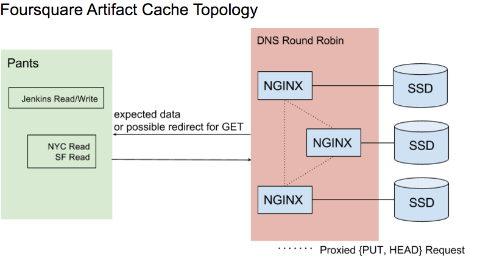

## Pants Artifact Cache (HTTP) (v2)

DEPRECATED(mateo): We now [use s3 for the artifact cache](https://github.com/foursquare/pants/commit/0e1cd99ff611ae28703eaa6366e678dedea4fabd).

### Pants Setup
* In `pants.ini`, point Pants at

If your cache server is available at `http://your-dns-rr` where `your-dns-rr` answers with `A` records for your proxy nodes, configure Pants by editing `pants.ini`:

    [DEFAULT]

    local_artifact_caches: ["%(pants_bootstrapdir)s/artifact_cache"]
    remote_artifact_caches: ["http://your-dns-rr"]
    all_artifact_caches: [
        "%(local_artifact_cache)s",
        "%(remote_artifact_cache)s"
      ]

      [cache]
      read_from: ["%(all_artifact_caches)s"]
      write_to: ["%(local_artifact_cache)s"]

This config allows local developers to consume the remote cache and write locally. Update your CI config to allow writes to the remote cache (e.g. `pants-jenkins.ini`).

### Cache Server
* We use nginx as the underlying RESTful server, as it supports `GET`, `HEAD`, `PUT` and `DELETE`. It stores the artifact files on three nginx servers at `/export/hd[bcd]` which are hit in round robin. See `/etc/nginx/nginx.conf` for details.

The `nginx.conf` is checked into the repo at `v2/nginx/nginx.conf`

### Cache Server setup
* Add servers to the `nginx.conf` (as many as you like).

For `HEAD`s and `PUT`s we have to proxy the traffic because Pants cannot follow redirects for those verbs. `PUT`s are low traffic and `HEAD`s aren’t too expensive to proxy. If a `GET` is sent to the wrong server then redirect.

Since we are using SSDs, we are omitting varnish for simplicity of design and can add it later if we need it.

### Endpoints
Each nginx node represents two endpoints: one for proxying to the right shard, and one for serving requests.
#### The proxy node (port 80)
* Use consistent hashing to figure out which node in the fleet is the correct shard.
* Proxy (stream) all requests through to that node.
* Set a header (the hostname of the proxy node) to make it possible for the upstream backend node to return a redirect if necessary.

#### The backend node (port 8080)
* Serve `HEAD` and `PUT` requests directly using normal DAV operations on a directory.
* For `GET` requests where the proxy node is the same as the backend node, serve the request directly.
* For `GET` requests where the proxy node is not the same as the backend node, return a redirect to the current backend node.  Pants will follow this redirect, and we get to avoid proxying the large data stream through the proxy node (pants fetches it directly after following the redirect).
* For `GET` requests where the proxy node header isn't set, assume we are satisfying a redirect and serve the request directly.

With DNS RR, we get easy load balancing among the proxy nodes while maintaining sharding for the highest throughput access (lots of `GET`s).

### Configuration files
The `nginx.conf` should be placed on the artifact cache machine at `/etc/nginx/nginx.conf`.

### Cleanup
The hosts relied on a cron job that cleaned old artifacts:

    SHELL=/bin/bash
    PATH=/sbin:/bin:/usr/sbin:/usr/bin
    MAILTO=root
    HOME=/

    # For details see man 4 crontabs

    # Example of job definition:
    # .---------------- minute (0 - 59)
    # |  .------------- hour (0 - 23)
    # |  |  .---------- day of month (1 - 31)
    # |  |  |  .------- month (1 - 12) OR jan,feb,mar,apr ...
    # |  |  |  |  .---- day of week (0 - 6) (Sunday=0 or 7) OR sun,mon,tue,wed,thu,fri,sat
    # |  |  |  |  |
    # *  *  *  *  * user-name command to be executed
      0  2  *  *  * nginx tmpwatch 3d /export/hdd3/data/appdata/nginx/pantscache/ /export/hdd3/data/appdata/nginx/tmp/
